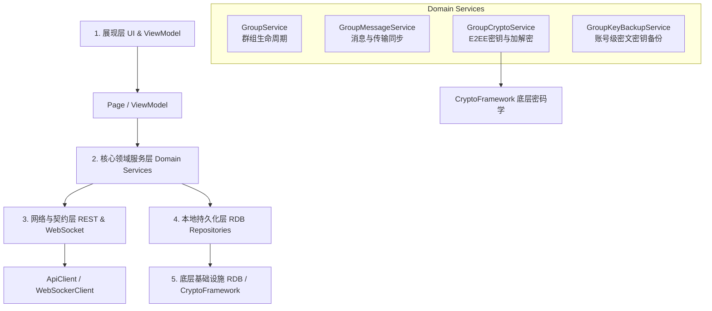

# CourseDrop 群组传输功能技术方案 (深度模块化与分层设计)

为了在 CourseDrop 项目中实现安全、完全可控的 Telegram 式群组文件投递功能，并遵循“安全与自主控制”这一宗旨，本设计方案抛弃了粗粒度的接口拼凑，转而采用**严格的面向对象与领域驱动设计 (DDD)** 架构，对群组传输进行深度分层和模块化划分。

---

## 1. 架构分层 (Layered Architecture)

为了保证客户端与服务端的解耦性及本地数据的机密性，群组文件传输功能在客户端被设计为 **五层架构**：



### 1.1 展现层 (UI & ViewModel)
- **职责**：绑定页面状态、响应交互。
- **文件与位置**：
  - `entry/src/main/ets/pages/GroupListPage.ets` (群组列表 UI)
  - `entry/src/main/ets/pages/GroupChatPage.ets` (群组消息与文件接收/投递 UI)
  - `entry/src/main/ets/viewmodels/GroupViewModel.ets` (状态持有者)

### 1.2 核心领域服务层 (Domain Services)
- **职责**：群组业务逻辑的核心封装层，实现按内容和关注点分离。
- **文件与位置**：
  - [GroupService.ets](../../apps/harmony/entry/src/main/ets/services/group/GroupService.ets)
  - [GroupMessageService.ets](../../apps/harmony/entry/src/main/ets/services/group/GroupMessageService.ets)
  - [GroupCryptoService.ets](../../apps/harmony/entry/src/main/ets/services/group/GroupCryptoService.ets)

### 1.3 网络与契约层 (REST & WebSocket Contract)
- **职责**：封装 REST API 交互和 WebSocket 的网络实时事件中继。
- **文件与位置**：
  - [GroupNetworkContract.ets](../../apps/harmony/entry/src/main/ets/services/group/GroupNetworkContract.ets)

### 1.3.1 源服务器与端到端加密边界

群组功能和普通公网文件传输一样，必须建立在“用户选择的源服务器/中转服务器”之上，而不是固定写死为 CourseDrop 官方公网服务。

产品约束如下：

- 用户可以配置自己的源服务器，群组、消息、文件都在该源服务器上中转。
- 服务端负责成员关系、密文消息、密文文件、过期清理和实时通知。
- 服务端不能保存群组 key、file key、明文文件名、明文消息或明文群名。
- 邀请链接或账号级密文密钥备份负责把群组 key 安全交给成员设备。
- 没有群组 key 的设备，即使是服务器管理员，也只能看到密文和元数据。

这意味着“完全公网”和“数据自己可控”并不冲突：公网只是网络可达性，数据主权来自用户可自建源服务器，内容安全来自端到端加密。

### 1.3.2 REST 与 WebSocket 分工

群组不自定义私有协议，避免后续维护成本失控。

- REST：可靠事实来源，负责创建群、加入群、上传密文文件、发送密文消息、按 cursor 补历史。
- WebSocket：实时通知层，负责告诉在线成员“有新密文消息/成员事件”，客户端收到后写入本地或触发 REST 补拉。
- 离线恢复：始终依赖 REST cursor，不依赖 WebSocket 保证消息不丢。

当前服务端已提供 `/ws/groups?fingerprintId=...` 作为群组实时事件通道的基础入口。

### 1.3.3 群组 key 备份与重装恢复

群组 key 备份是账号级能力，不是服务器托管明文密钥。

- 上传备份前，鸿蒙端使用用户侧恢复密钥或密码派生密钥对群组 key 备份载荷进行 AES-GCM 加密。
- 服务端只保存 `algorithm`、`kdfAlgorithm`、`kdfSalt`、`iv`、`authTag`、`encryptedPayload` 等密文容器字段。
- 上传备份要求当前 fingerprint 已绑定账号且仍是群成员。
- 列出备份按账号维度返回，便于卸载重装后新 fingerprint 登录同账号后恢复旧群组。
- 恢复后客户端再根据备份中的 `groupId` 加入群组并通过 REST cursor 补拉密文消息。
- 当前鸿蒙端恢复口令使用 `SHA256-PASSPHRASE-V1` 派生 AES-256 key，后续应替换为参数化 KDF。

### 1.4 本地持久化层 (Database & Repository Layer)
- **职责**：本地数据库的读写代理。
- **文件与位置**：
  - `entry/src/main/ets/services/group/LocalGroupRepository.ets` (群组列表本地持久化)
  - `entry/src/main/ets/services/group/LocalGroupMessageRepository.ets` (消息与传输历史持久化)

### 1.5 底层基础设施层 (Infrastructure & Cryptography)
- **职责**：封装系统能力。包括 RDB 数据库驱动、`cryptoFramework` 的 AES-GCM 与非对称算法的底层对接。

---

## 2. 数据结构与消息契约定义

在群组中，一切投递和通知被抽象为**多态消息流**。群组的文件传输载荷必须复用并扩展目前的传输结构。

### 2.1 群组元数据定义
```typescript
/**
 * 群组配置参数
 */
export interface GroupConfig {
  allowText: boolean;           // 是否允许发送文本（仅保留未来聊天支持）
  expiryHours: number;          // 文件的默认过期时间 (TTL)
  maxFileSizeMb: number;        // 文件大小限制
  avatarText?: string;          // 群头像首字/标记
  avatarColor?: string;         // 群头像主题色
}

/**
 * 客户端本地存储的群组实体（包含对称根密钥）
 */
export interface GroupSession {
  id: string;                   // 群组 ID (UUID)
  encryptedName: string;        // 在服务器端存储的加密群名
  plainName: string;            // 本地解密后的群名
  creatorId: string;            // 创建者的设备指纹 ID
  joinedAt: string;             // 本机加入时间 (ISO-8601)
  status: 'ACTIVE' | 'ARCHIVED' | 'DISBANDED';
  groupKey: string;             // 本对称加密密钥 (Hex/Base64 编码的 AES-256 Key) - 严禁上传至服务器
  config: GroupConfig;          // 群组属性配置
}
```

### 2.2 多态群组消息格式 (GroupMessage)
所有的文件分享、文字消息、控制指令均以 `GroupMessage` 为基础载荷，使用 `GroupCryptoService` 进行加密。

```typescript
export type GroupMessageType = 'TEXT' | 'FILE' | 'CONTROL';
export type GroupControlAction = 'MEMBER_JOIN' | 'MEMBER_LEAVE' | 'KEY_ROTATION';

/**
 * 通用群组消息外壳
 */
export interface GroupMessage {
  id: string;                   // 消息唯一标识 (UUID)
  groupId: string;              // 所属群组 ID
  senderId: string;             // 发送者设备指纹 ID
  type: GroupMessageType;       // 消息类型
  createdAt: string;            // 消息创建时间
  iv: string;                   // 加密 Payload 时使用的初始化向量 (IV)
  authTag?: string;             // AES-GCM 的校验验证标签 (Authentication Tag)
  
  // 密文 Payload：在发送时由具体子载荷序列化并加密生成
  encryptedPayload: string;
}

/**
 * 1. 文本载荷 (明文)
 */
export interface PlainTextPayload {
  text: string;                 // 文本消息明文
}

/**
 * 2. 控制消息载荷 (明文)
 */
export interface PlainControlPayload {
  action: GroupControlAction;   // 控制动作
  targetMemberId?: string;      // 目标成员指纹
  extraData?: string;           // 额外附加配置（如密钥轮换时的封装数据）
}

/**
 * 3. 文件消息载荷 (明文) - 继承并复用 TransferItem / ShareItem 的契约设计
 */
export interface PlainFilePayload {
  itemId: string;               // 对应服务端物理文件的存储标识 (File UUID)
  displayName: string;          // 文件明文显示名
  sizeBytes: number;            // 密文文件在服务端的真实物理大小（字节）
  plainSizeBytes?: number;      // 明文大小
  contentType: string;          // 文件的 MIME 类型明文 (例如 image/png, application/zip)
  sha256: string;               // 密文文件在服务端的哈希校验和 (防止中继节点篡改篡取)
  fileKeyIv: string;            // 加密该物理文件使用的 IV (独立于群组消息 IV，确保多文件安全性)
  fileKeyTag: string;           // 物理文件加密时的 AES-GCM Authentication Tag
}
```

---

## 3. 本地持久化层数据库设计 (RDB Schema)

为了防止未授权的应用对客户端私有数据库进行数据提取，本地 RDB 中凡是涉及传输内容（显示名、文本消息、类型）的字段，一律存为密文，仅在内存或展现层被解密。

```sql
-- 1. 本地已加入群组表
CREATE TABLE IF NOT EXISTS local_groups (
  id TEXT PRIMARY KEY,
  encrypted_name TEXT NOT NULL,
  creator_id TEXT NOT NULL,
  joined_at TEXT NOT NULL,
  status TEXT NOT NULL,
  group_key TEXT NOT NULL,       -- 对称密钥本地安全落盘存储
  config_json TEXT NOT NULL
);

-- 2. 群组消息流水表
CREATE TABLE IF NOT EXISTS local_group_messages (
  id TEXT PRIMARY KEY,
  group_id TEXT NOT NULL,
  sender_id TEXT NOT NULL,
  type TEXT NOT NULL,
  created_at TEXT NOT NULL,
  iv TEXT NOT NULL,
  auth_tag TEXT,
  encrypted_payload TEXT NOT NULL,
  FOREIGN KEY(group_id) REFERENCES local_groups(id) ON DELETE CASCADE
);
```

---

## 4. 领域服务层 API 接口与方法签名设计

我们在 `services/group` 目录下实现的三大服务，具备明确的方法边界、入参与出参契约。

### 4.1 GroupCryptoService.ets
底层加解密的核心中枢，负责处理密文数据的封装与解析。

```typescript
import { GroupSession, GroupMessage, PlainFilePayload, PlainTextPayload, PlainControlPayload } from '../../models/group/types';

export class GroupCryptoService {
  /**
   * 随机生成一个新的 AES-256 群组根密钥
   */
  generateGroupKey(): string { return ''; }

  /**
   * 加密群名及配置等元数据
   */
  encryptGroupMetadata(plainName: string, groupKey: string): { ciphertext: string; iv: string } {
    return { ciphertext: '', iv: '' };
  }

  /**
   * 解密群名及配置等元数据
   */
  decryptGroupMetadata(ciphertext: string, iv: string, groupKey: string): string { return ''; }

  /**
   * 加密文件投递消息载荷 (将 PlainFilePayload 转为加密字符串)
   */
  encryptFilePayload(payload: PlainFilePayload, groupKey: string): { ciphertext: string; iv: string; tag: string } {
    return { ciphertext: '', iv: '', tag: '' };
  }

  /**
   * 解密文件投递消息载荷
   */
  decryptFilePayload(ciphertext: string, iv: string, tag: string, groupKey: string): PlainFilePayload {
    // 解密后的结构
    return null as unknown as PlainFilePayload;
  }

  /**
   * 加密文本消息载荷 (PlainTextPayload)
   */
  encryptTextPayload(payload: PlainTextPayload, groupKey: string): { ciphertext: string; iv: string; tag: string } {
    return { ciphertext: '', iv: '', tag: '' };
  }

  /**
   * 解密文本消息载荷
   */
  decryptTextPayload(ciphertext: string, iv: string, tag: string, groupKey: string): PlainTextPayload {
    return null as unknown as PlainTextPayload;
  }
}
```

### 4.2 GroupService.ets
负责处理群组自身的生命周期，成员变动，并管理本地群组列表。

```typescript
import { GroupSession } from '../../models/group/types';

export class GroupService {
  /**
   * 创建一个全新的加密群组
   * @param name 群明文名称
   */
  async createGroup(name: string): Promise<GroupSession> {
    // 1. 生成本地 GroupKey
    // 2. 调用 GroupCryptoService 加密群名称
    // 3. 发送请求给服务端创建群组元数据
    // 4. 将明文 Key、群组 ID 及配置保存到本地 SQLite (local_groups)
    return null as unknown as GroupSession;
  }

  /**
   * 解析邀请链接或扫描二维码加入加密群组
   * @param inviteUrl 带 #groupkey= 碎片的群组链接
   */
  async joinGroup(inviteUrl: string): Promise<GroupSession> {
    // 1. 从 URL fragment (#) 提取解密群根密钥
    // 2. 从 query 提取群 UUID
    // 3. 调用 API 获取服务端该群加密元数据并完成校验
    // 4. 本地解密群名称，并将群组记录保存到本地 local_groups
    return null as unknown as GroupSession;
  }

  /**
   * 退出指定的群组，并清除本地记录与密钥
   */
  async leaveGroup(groupId: string): Promise<void> {
    // 1. 调用后端接口退出该群组成员关系
    // 2. 在本地 RDB 删除 local_groups 及关联的历史消息，以彻底销毁密钥
  }

  /**
   * 获取本地已加入的所有群组会话列表
   */
  async getLocalGroups(): Promise<GroupSession[]> {
    return [];
  }
}
```

### 4.3 GroupMessageService.ets
负责消息的处理，对接上传下载服务。

```typescript
import { GroupMessage, PlainFilePayload } from '../../models/group/types';

export class GroupMessageService {
  /**
   * 向群组内投递一个本地文件
   * @param groupId 目标群组 ID
   * @param localFileUri 客户端物理文件 URI
   */
  async sendGroupFile(groupId: string, localFileUri: string): Promise<GroupMessage> {
    // 1. 读取 local_groups 获取对应的 groupKey
    // 2. 为文件生成独立的临时加密密钥 (File Key)
    // 3. 对物理文件进行 AES-GCM 加密，并写入本地传输缓存
    // 4. 调用原有的上传引擎，上传加密后的物理文件，拿到 remoteItemId
    // 5. 组装 PlainFilePayload，调用 GroupCryptoService 用 groupKey 对此 Payload 加密
    // 6. 调用网络层接口发送加密后的 GroupMessage，并保存至本地数据库
    return null as unknown as GroupMessage;
  }

  /**
   * 下载、校验并本地解密群组中的文件消息
   * @param messageId 待下载的群组消息 ID
   */
  async receiveGroupFile(messageId: string): Promise<string> {
    // 1. 从本地 local_group_messages 中提取该消息的密文 payload 
    // 2. 获取该群组的 groupKey
    // 3. 解密得到 PlainFilePayload (包含物理文件 itemId、解密密钥和 IV)
    // 4. 调用下载引擎下载该 itemId 的密文文件
    // 5. 校验 SHA-256 完整性哈希
    // 6. 使用解密出的 fileKey 还原文件，写入本地库，并更新本地文件索引
    return '';
  }

  /**
   * 同步拉取群组中的增量消息
   */
  async syncGroupMessages(groupId: string, lastMessageId?: string): Promise<GroupMessage[]> {
    // 1. 从 API 端同步拉取增量消息包
    // 2. 将密文消息直接落地写入本地数据库
    return [];
  }
}
```

---

## 5. 网络接口与通信层 (API REST Contract)

Java 服务端针对群组提供如下接口契约规范。服务器只允许保存密文（群名、载荷）与群组 UUID。

### 5.1 创建群组
- **接口**：`POST /api/groups`
- **请求体**：
  ```json
  {
    "id": "c7a7bd48-26fa-4b6b-8bbf-85f839c09c25",
    "encryptedName": "U2FsdGVkX195r...",
    "iv": "d3a24db905c138",
    "configJson": "{\"allowText\":true,\"expiryHours\":24}"
  }
  ```

### 5.2 发送群组消息/文件元数据
- **接口**：`POST /api/groups/{groupId}/messages`
- **请求体**：
  ```json
  {
    "id": "e838ff48-3a9a-4c28-98bc-8d99ee229499",
    "senderId": "fingerprint_device_01",
    "type": "FILE",
    "iv": "3aefdb11a90c",
    "authTag": "f90c88bcad01",
    "encryptedPayload": "V2hhdGV2ZXJNZXNzYWdlUGF5bG9hZA=="
  }
  ```

---

## 6. 开发与实施落地计划 (模块化递进)

```text
[第一步：底层密码与持久层]
├─ 1. 在 models 目录定义群组与多态消息 TypeScript 类型
├─ 2. 在 RdbLocalFileIndexRepository 下级补充 RDB 表初始化建表 SQL 
└─ 3. 实现 GroupCryptoService 基础的对称加解密逻辑

[第二步：网络交互与服务端]
├─ 1. 定义 REST API 对应的数据传输对象 (DTO)
├─ 2. 完善 Java 服务端 GroupController 与底层 SQLite 持久层接口
└─ 3. 实现同步增量消息 (Polling / Sync) 机制

[第三步：核心领域服务封装]
├─ 1. 完善 GroupService 的创建、加入与本地数据持久化操作
├─ 2. 编写 GroupMessageService 的发送与接收，对接已有的上传/下载核心逻辑
└─ 3. 将本地存储的消息密文转为展现层明文模型

[第四步：UI 与联调回归]
├─ 1. 构建群组列表及详情的 UI (CdPanel + 列表)
├─ 2. 构建传输流程状态提示（加密中 -> 上传中 -> 成功 -> 收到 -> 解密中）
└─ 3. 编写双端测试，验证服务器端数据库和物理存储完全不包含文件名与内容明文。
```

## 7. 一对一会话规划

一对一不建议另起一套协议。它可以作为“成员数为 2 的加密会话”建立在群组能力之上。

建议的后续模型：

```text
Conversation
  id
  type: GROUP | DIRECT
  encryptedName
  avatar
  members
  keyMaterialRef

Message
  conversationId
  type: TEXT | FILE | CONTROL
  encryptedPayload
```

落地策略：

- 短期：继续把群组跑通，不引入一对一入口。
- 中期：抽象 `ConversationService`，把当前 `GroupService/GroupMessageService` 的 UI 入口泛化。
- 长期：一对一使用相同的 REST + WebSocket + E2EE 管线，只在邀请、标题、头像和成员管理上做差异化。

工期判断：如果现在就做一对一，会明显增加 UI、邀请、密钥交换和身份展示的工作量；如果先把群组封装成 conversation 模型，再接一对一，增量会小很多。因此一对一先进入规划，不进入当前迭代。
